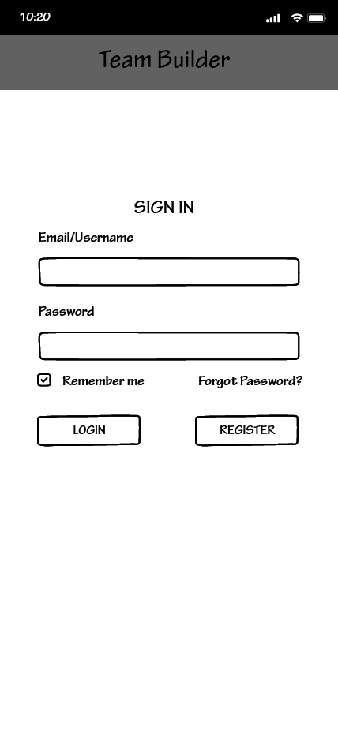
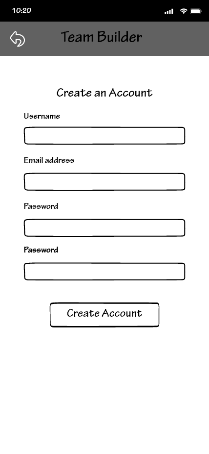

# Team Builder Wireframes
<table>
<tbody>
<tr>
<td></td>
<td>1. The first thing you will see when loging into the app is the Log in page. Here we have a place for a Username and Password with The ability to Log in of Register a new account if one is not already created.</td>
</tr>
<tr>
<td></td>
<td>2. When selecting to Register, the user is prompted to input a username, email address, and a password and is then prompted to create their acount.</td>
</tr>
<tr>
<td></td>
<td>3. Upon account creation, the user is prompted to create or join their first group</td>
</tr>
<tr>
<td></td>
<td>4. Tapping the + Group button will display two buttons for either creating or joining a group.</td>
</tr>
<tr>
<td>&nbsp;</td>
<td>&nbsp;</td>
</tr>
<tr>
<td>&nbsp;</td>
<td>&nbsp;</td>
</tr>
<tr>
<td>&nbsp;</td>
<td>&nbsp;</td>
</tr>
<tr>
<td>&nbsp;</td>
<td>&nbsp;</td>
</tr>
<tr>
<td>&nbsp;</td>
<td>&nbsp;</td>
</tr>
<tr>
<td>&nbsp;</td>
<td>&nbsp;</td>
</tr>
<tr>
<td>&nbsp;</td>
<td>&nbsp;</td>
</tr>
<tr>
<td>&nbsp;</td>
<td>&nbsp;</td>
</tr>
</tbody>
</table>
